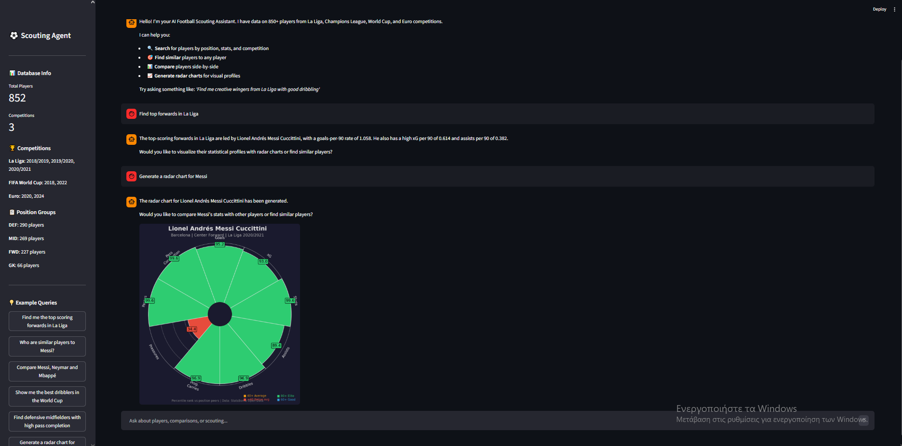

# ⚽ AI Football Scouting Agent

An intelligent, conversational AI agent that assists football scouts and analysts in finding, comparing, and evaluating players using natural language queries. Built with LangChain, Groq (Llama 3.3), and StatsBomb open data.

> *"Find me a creative winger with strong dribbling and goal threat from La Liga"*
> — and the agent searches, filters, compares, and visualizes player profiles.



---

## Features

- **Natural Language Scouting** — Ask questions in plain English, the agent decides which tools to use
- **Player Search** — Filter by position, competition, team, and statistical thresholds
- **Similarity Engine** — Find players with similar profiles using cosine similarity on per-90 stats
- **Player Comparison** — Side-by-side statistical comparison of 2-4 players
- **Radar Charts** — Visual percentile-based pizza charts for player profiling
- **Multi-Competition Database** — 850+ players from La Liga, Champions League, World Cup, and Euro

---

## Tech Stack

| Component | Technology |
|-----------|-----------|
| **LLM** | Llama 3.3 70B via Groq API (free tier) |
| **Agent Framework** | LangChain + LangGraph (ReAct pattern) |
| **Data** | StatsBomb Open Data (statsbombpy) |
| **ML** | scikit-learn (similarity, clustering) |
| **Visualizations** | mplsoccer, matplotlib |
| **UI** | Streamlit |
| **Language** | Python 3.12+ |

---

## Architecture
```
┌─────────────────────────────────────────────┐
│              STREAMLIT UI                    │
│   Chat Interface + Radar Chart Display      │
├─────────────────────────────────────────────┤
│           LLM ORCHESTRATOR                  │
│   Groq API + Llama 3.3 70B                 │
│   LangChain ReAct Agent                    │
├─────────────────────────────────────────────┤
│              TOOL LAYER                     │
│  search_players    | find_similar_players   │
│  compare_players   | generate_radar_chart   │
│  get_player_stats                           │
├─────────────────────────────────────────────┤
│             DATA LAYER                      │
│  StatsBomb Open Data → Per-90 Normalized    │
│  Percentile Rankings by Position Group      │
└─────────────────────────────────────────────┘
```

---

## Quick Start

### 1. Clone the repository
```bash
git clone https://github.com/panospen/football-scouting-agent.git
cd football-scouting-agent
```

### 2. Create virtual environment
```bash
python -m venv venv
# Windows
.\venv\Scripts\Activate.ps1
# Mac/Linux
source venv/bin/activate
```

### 3. Install dependencies
```bash
pip install -r requirements.txt
```

### 4. Set up API key

Create a `.env` file in the project root:
```
GROQ_API_KEY=your_groq_api_key_here
```

Get a free API key at [console.groq.com](https://console.groq.com).

### 5. Build the player database
```bash
python -m src.data.feature_store
```

This fetches data from StatsBomb and builds the player database (~15-20 minutes on first run).

### 6. Run the app
```bash
streamlit run app/streamlit_app.py
```

Or use the terminal agent:
```bash
python -m src.agent.agent
```

---

## Example Queries

| Query | What the agent does |
|-------|-------------------|
| "Find top scoring forwards in La Liga" | Searches FWD players, sorts by goals/90 |
| "Who plays like Messi?" | Cosine similarity on per-90 stats |
| "Compare Messi, Neymar, and Mbappé" | Side-by-side statistical comparison |
| "Generate a radar chart for Busquets" | Pizza chart with percentile rankings |
| "Find defensive midfielders with 90%+ pass completion" | Filtered search with stat thresholds |
| "I need a left winger with good dribbling for my team" | Multi-criteria search + recommendations |

---

## Data Coverage

| Competition | Seasons | Source |
|------------|---------|--------|
| La Liga | 2018/19 – 2020/21 | StatsBomb Open Data |
| Champions League | 2017/18 – 2018/19 | StatsBomb Open Data |
| FIFA World Cup | 2018, 2022 | StatsBomb Open Data |
| Euro | 2020, 2024 | StatsBomb Open Data |

All statistics are normalized per 90 minutes and percentile-ranked within position groups (FWD, MID, DEF, GK) for fair comparison.

---

## Project Structure
```
football-scouting-agent/
├── app/
│   └── streamlit_app.py        # Streamlit web interface
├── src/
│   ├── agent/
│   │   ├── agent.py            # LangChain ReAct agent
│   │   ├── prompts.py          # System prompt
│   │   └── tools_wrapper.py    # LangChain tool definitions
│   ├── data/
│   │   ├── loader.py           # StatsBomb data fetching
│   │   ├── preprocessor.py     # Per-90 normalization
│   │   └── feature_store.py    # Player database pipeline
│   └── tools/
│       ├── search.py           # Player search & filtering
│       ├── similarity.py       # Cosine similarity engine
│       ├── compare.py          # Player comparison
│       └── visualization.py    # Radar/pizza charts
├── data/
│   ├── processed/              # Cached player database
│   └── charts/                 # Generated radar charts
├── notebooks/                  # EDA notebooks
├── tests/                      # Unit tests
├── requirements.txt
└── README.md
```

---

## Key Technical Decisions

- **Per-90 normalization**: All counting stats are divided by minutes played and multiplied by 90, ensuring fair comparison regardless of playing time
- **Position-group percentiles**: Players are ranked against peers in the same position group (FWD/MID/DEF/GK), not the entire database
- **Minimum minutes threshold**: Only players with 300+ minutes are included to ensure statistical reliability
- **Cosine similarity**: Used for player similarity as it captures the shape of statistical profiles rather than absolute values
- **ReAct agent pattern**: The agent reasons about which tools to use, executes them, observes results, and iterates — enabling complex multi-step scouting queries

---

## Future Improvements

- [ ] Add more competitions and seasons
- [ ] Player clustering for archetype discovery (K-Means)
- [ ] Squad gap analysis tool
- [ ] Season-over-season player development tracking
- [ ] Integration with FBref for broader data coverage
- [ ] Deploy to Streamlit Community Cloud

---

## License

MIT License — see [LICENSE](LICENSE) for details.

## Data Attribution

Data provided by [StatsBomb](https://statsbomb.com). StatsBomb Open Data is free for research and analysis.


